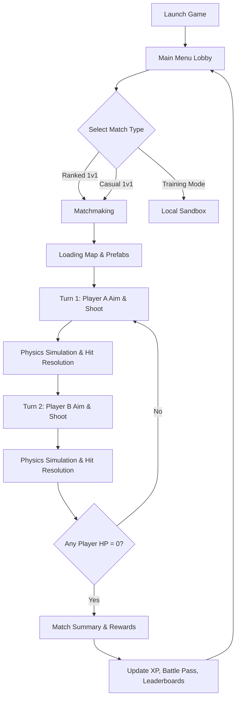

# War Trajectory Mobile (WTM) - Core Game Design Document (GDD)

**Version:** 1.0.0
**Target Platform:** Mobile (iOS & Android)
**Game Engine:** Unity 3D
**Networking:** Photon Fusion (Server-Authoritative, Predict-&-Rollback)
**Genre:** 1v1 Turn-Based Physics-Based PvP Tactical Shooter
**Business Model:** Free-to-Play (Strictly Non-Pay-to-Win, Cosmetic & Ad Driven)

---

## 1. Executive Summary

### 1.1 Overview
*War Trajectory Mobile* (WTM) is an elite, high-fidelity (AAA-qualityized) 3D turn-based tactical physics game designed for mobile devices. Inspired by the casual accessibility of *Bowmasters* and the tactical depth of *Worms*, WTM introduces a competitive, skill-based, 3D trajectory-aiming arena.

Two players stand on opposite sides of a stylized 3D map, utilizing a tactile, intuitive "Pull-Back" gesture on their mobile touchscreens to adjust launch angles and velocities. Players must account for gravity, dynamic winds, terrain obstacles, and weapon weights to lob various projectiles—ranging from composite bows to micro-tactical nuclear rockets—at their opponent. The player whose health points reach zero first loses.

### 1.2 Core Vision & Value Proposition
*   **Skill is Sovereign:** Absolutely no stat-altering upgrades or pay-to-win mechanics. Skill is measured by the player's ability to estimate parabolas under wind interference and tactical skill management.
*   **Deterministic Physics as the Core Loop:** Every shot is a simulated physical entity. Wind, gravity, density, and impact vectors are calculated on a server-authoritative engine, offering satisfying and reliable gameplay.
*   **High-End Visual Aesthetic:** Stylized-realism characters with premium lighting, dynamic volumetric particle effects, and highly fluid, responsive animations operating at up to 120 FPS.
*   **Fast-Paced Sessions:** Intense, rapid 2-to-5 minute matches, tailored perfectly for on-the-go mobile play.

---

## 2. Target Audience & Platform Strategy

### 2.1 Demographics & Player Profiles
*   **Primary Audience:** Mid-core to hard-core mobile competitive players (Ages 14–35) who enjoy games like *Brawl Stars*, *Clash Royale*, *Bowmasters*, and competitive physics-based shooters.
*   **Secondary Audience:** Retro gamers and tactical fans who grew up playing *Worms* or *Gunbound*, looking for a modernized 3D equivalent on mobile devices.

### 2.2 Platform-Specific Goals
*   **Universal Input:** Perfected double-tap, drag, hold, and release gestures optimized for touch displays of varying sizes.
*   **Performance Optimization:** Scalable graphic presets targeting constant 60 FPS on mid-range devices (e.g., Snapdragon 700-series / Apple A11) and 120 FPS support on flagship high-refresh displays (e.g., Apple iPad Pro, high-end Samsung Galaxy S/Z series).
*   **Low Latency Netcode:** Tailored for mobile networks (4G, 5G, Wi-Fi) using Photon Fusion to gracefully handle packet loss and temporary handovers.

---

## 3. Product Pillars

### Pillar 1: Absolute Precision & Skill Mastery
Every shot is a calculated decision. Players learn the direct relationship between pulling distance (Force) and pull angle (Trajectory) relative to wind direction and velocity. Luck is minimized; mastery of the physical mechanics is the sole path to top leaderboards.

### Pillar 2: Visceral Physics Feedback
When a projectile impacts, the world reacts. Arrows stick deep into character models or shields; rocket explosions push characters backward off edges; heavy strikes cause dynamic ragdoll falls; and specific environment elements break into debris.

### Pillar 3: Tactical Depth via Skills
Weapons are not the only option. Players equip two tactical abilities (e.g., Teleport, Wind Control, Forcefields) and build charge toward an ultimate ability. This transforms a basic "aim and shoot" loop into a high-stakes chess match.

### Pillar 4: Premium Cosmetic Economy
Players express themselves through 100% cosmetic skins (knights, samurai, cyber-soldiers) that alter animations, visual effects, and emotes, maintaining competitive integrity with zero pay-to-win elements.

---

## 4. High-Level Game Loop

*   **Session Length:** 2 to 5 minutes.
*   **Turn Timer:** Strict 12 to 15 seconds per turn to maintain adrenaline and fast pacing.
*   **Ad-Integration:** Rewarded ads for XP boosts and cosmetic crates, with no forced interstitial ads that disrupt the gaming flow.
