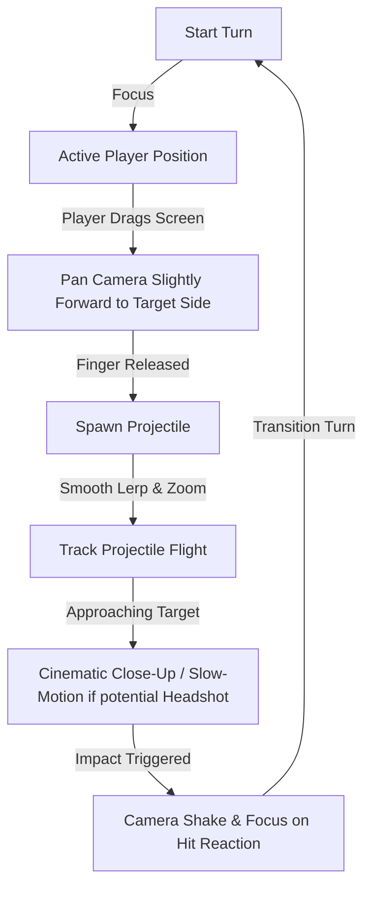

# War Trajectory Mobile (WTM) - Core Gameplay Systems

This document details the moment-to-moment mechanics, controls, camera systems, turn progression, and physics interactions of *War Trajectory Mobile*.

---

## 1. Input & Controls: Pull-Back Target Aiming

The touch control system uses a classic "Pull-Back" mechanics model, calibrated for high-precision, sub-degree adjustments.

```
       [Screen Center / Player Character Location]
                         o
                        / \
                       /   \
                      /     \
                     /       \
                    /         \
   (Aim Arrow)     * <---------------------- (Finger Drag Center)
                  /                           |
                 /                            |   Drag Distance (d)
                /                             |   determines Launch Force.
               v                              v
    [Drag Backwards Vector] ------------> [Touch Point]
```

### 1.1 Touch Mechanics Pipeline
1.  **Touch Phase (Began):**
    *   The player touches anywhere on the screen (the system is screen-agnostic and does not require touching the character itself, preventing fingers from blocking the player's view).
    *   The touch position is recorded as `TouchOrigin`.
2.  **Touch Phase (Moved / Dragged):**
    *   The current touch position is recorded as `TouchCurrent`.
    *   The pull vector is calculated: $\vec{V}_{pull} = \text{TouchOrigin} - \text{TouchCurrent}$.
    *   The drag distance $d$ is clamped: $d = \min(||\vec{V}_{pull}||, d_{max})$.
    *   The normalized direction of aiming is calculated: $\vec{D}_{aim} = \frac{\vec{V}_{pull}}{||\vec{V}_{pull}||}$.
    *   Launch Angle $\theta$ is derived: $\theta = \text{atan2}(\vec{D}_{aim}.y, \vec{D}_{aim}.x) \times \frac{180}{\pi}$.
    *   The Launch Force percentage $F_{pct}$ is derived: $F_{pct} = \frac{d}{d_{max}}$.
3.  **Visual Indicators:**
    *   A stylized visual UI arrow extends from the player's character in the **positive** direction ($\vec{D}_{aim}$) scaling its length and intensity (e.g., changing color from green to orange to pulsing red) based on $F_{pct}$.
    *   A dashed parabola trajectory preview line is generated using the current force and angle.
4.  **Touch Phase (Ended):**
    *   If $F_{pct} < 0.05$, the action is cancelled to allow safe finger release.
    *   If $F_{pct} \geq 0.05$, the turn transitions to the "Firing Phase" and the projectile is spawned.

---

## 2. Turn-Based Progression Flow

WTM uses an asynchronous-input but real-time-evaluated Turn Loop.

### 2.1 Turn Cycle Timeline
1.  **Turn Initialization (1.5 seconds):**
    *   Calculate and display the new wind vector $\vec{W}$ for the turn.
    *   Apply passive tick events (like burning damage, healing over time).
    *   Start the turn timer (15 seconds).
2.  **Active Input Turn (15 seconds maximum):**
    *   The active player has free movement within restricted limits (such as jumping or teleports), can trigger one Skill, and can perform the Pull-Back aiming gesture.
    *   *Timeout Penalty:* If the timer reaches 0, the player automatically fires a default projectile with a low-power, flat vector ($F_{pct} = 0.25$, $\theta = 0^\circ$) to avoid idle blocking.
3.  **Execution & Ballistic Flight Phase (Variable, max 10 seconds):**
    *   Controls are locked.
    *   The camera tracks the projectile in real-time.
    *   Skill modifiers are evaluated.
4.  **Impact & Resolution Phase (2.5 seconds):**
    *   Projectile impacts. Ragdolls, damage floating text, explosion particles, and environmental deformation trigger.
    *   Camera centers on the victim to capture hit reactions.
5.  **Turn Handover:**
    *   Active turn authority is handed over to the opposing player.

---

## 3. Dynamic Camera System

The camera acts as a dynamic director to maximize game feel and tactical clarity.



### 3.1 Camera Rules
*   **Static Frame:** Orthographic-like Perspective perspective camera (Field of View = 35) to minimize barrel distortion and preserve projectile arc readability.
*   **Split Screen (Multi-Target Zoom):** If a skill like "Double Damage" triggers multiple projectiles, the camera zooms out dynamically to keep all projectiles in the view frame.
*   **Cinematic Hit Camera:** If a calculation indicates a projectile will hit within 0.5 meters of the head bone, the camera performs a quick 1.5x zoom and reduces game speed to 0.5x (Time Slow) for maximum dramatic effect.

---

## 4. Realistic Ballistics & Environmental Mechanics

### 4.1 Wind Mechanics
Wind acts as a persistent drift force.
*   **Wind Vector:** $\vec{W} = (W_x, W_y, W_z)$. Since the movement is simulated in a 3D plane (oriented on the X/Y axes), $\vec{W}$ has dominant X (horizontal drift) and Y (vertical thermal draft) forces.
*   **Wind Generation Formula:**
    $$W_x = \text{Random}(-W_{limit}, W_{limit})$$
    $$W_y = \text{Random}(-0.3 \times W_{limit}, 0.3 \times W_{limit})$$
    Where $W_{limit}$ is defined by the map's weather profile (e.g., $10.0 \text{ m/s}$ in Desert Canyon).

### 4.2 Impact Physics and Destructible Environment
*   **Angle of Attack Reaction:**
    *   *Sharp Angles ($<15^\circ$ to surface normal):* Projectiles like throwing axes or arrows will bounce off hard armor plates or shields.
    *   *Optimal Angles ($\geq 15^\circ$):* Sharp projectiles penetrate and stick to the object's mesh.
*   **Environmental Degradation:** Terrain uses voxel or simplified polygon-subtraction meshes. When an explosive rocket impacts, a sphere-subtraction algorithm deletes vertices within the explosion radius, altering the ground height and removing strategic cover options.
*   **Dynamic Knockback & Fall:**
    *   Characters hit by heavy explosives receive an impulse force vector $\vec{I}$ away from the explosion epicenter:
        $$\vec{I} = \text{Force}_{impulse} \times \left(1 - \frac{\text{Distance}}{\text{Radius}}\right) \times \hat{u}$$
        where $\hat{u}$ is the unit direction vector from epicenter to character center of mass.
    *   If $\vec{I}$ exceeds the character's balance threshold, they trip and transition into a dynamic **Ragdoll state** for 2 seconds.
