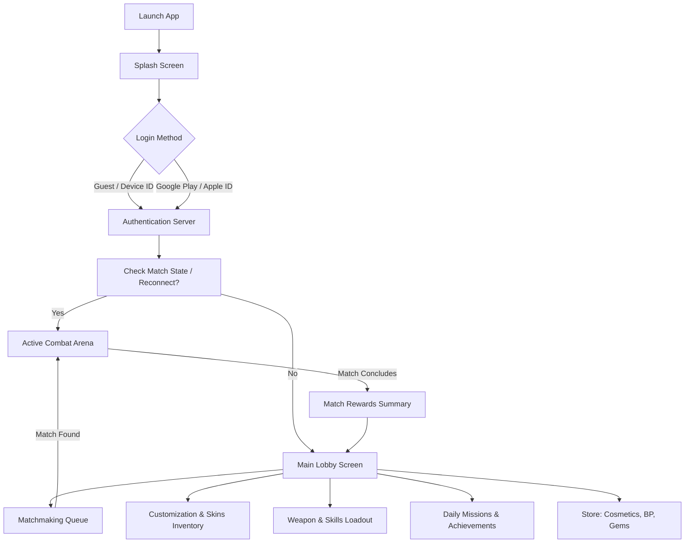

# War Trajectory Mobile (WTM) - UI/UX Architecture & Layouts

WTM is designed for fast-paced, competitive mobile play. This document details the visual flow, menu navigation, touch-screen UI layouts, and the user experience journey.

---

## 1. User Flow Diagram (Screen Navigation)

This Mermaid diagram illustrates the navigational flow across screens:



---

## 2. HUD Layout (Gameplay Screen Wireframe)

The gameplay HUD is designed to keep all vital tactical information visible while ensuring the touch control area remains clear.

```
+-------------------------------------------------------------------------+
| [G] Guest_402  [HP: 100/100] [====]           [====] [HP: 100/100] Enemy |
| [Shield Active]                                      [Double Dmg Active]|
|                                                                         |
|                          [   WIND: <--- 5.4 m/s   ]                     |
|                                                                         |
|   (X) Menu / Settings                                                   |
|                                                                         |
|                                                                         |
|                                                                         |
|                                                                         |
|                                                                         |
|      (Player A)                                          (Player B)     |
|         O                                                    O          |
|        /|\                                                  /|\         |
|        / \                                                  / \         |
|   +-----------+                                        +-----------+    |
|   | Sandstone |                                        | Sandstone |    |
|   +-----------+                                        +-----------+    |
|                                                                         |
| +---------------------------------------------------------------------+ |
| | [Bow]  [Rocket]  [Axe]  |  (Shield)  (DoubleDmg)  (Ultimate 85%) |Em | |
| | <--- WEAPONS SELECTION ---> | <--- SKILLS SELECTION --->             |ote| |
| +---------------------------------------------------------------------+ |
+-------------------------------------------------------------------------+
```

### 2.1 UI Layout Details:
*   **Top Bar:** Displays player avatars, health bars, active status effects (e.g., active shields), and the wind speed/direction meter.
*   **Middle Area:** Dedicated to gameplay. Free of buttons to prevent accidental inputs during the Pull-Back gesture.
*   **Bottom Tray (The Action Deck):**
    *   **Left Half:** Quick-select buttons for the three equipped weapons. Tapping a weapon switches the active projectile.
    *   **Right Half:** Tactical skill buttons. Tapping a skill triggers it for the current turn.
    *   **Emote Button (Right Corner):** Tapping opens a quick swiping wheel to send emotes.

---

## 3. Main Lobby Screen Layout

The Main Lobby serves as the primary hub for players between matches.

```
+-------------------------------------------------------------------------+
| [Profile] Lv.15 Vance   [XP: 2,500/10,000]          [Coins: 4,200] [Gems: 120] |
+-------------------------------------------------------------------------+
|                                                                         |
|  [Daily Rewards: CLAIM]                                [Battle Pass]    |
|                                                        [Lv. 8 [====]  ] |
|                                                                         |
|                           +-------------------+                         |
|                           |   Active Character|                         |
|                           |      3D Model     |                         |
|                           |    (Apex Spectre) |                         |
|                           +-------------------+                         |
|                                                                         |
|  [ INVENTORY ]                                          [ SHOP ]        |
|  (Skins & Weapons)                                      (Cosmetics)     |
|                                                                         |
|                                                                         |
|                        +-------------------------+                      |
|                        |       BATTLE PvP        |                      |
|                        |      [ Ranked 1v1 ]     |                      |
|                        +-------------------------+                      |
|                                                                         |
+-------------------------------------------------------------------------+
```

### 3.1 Main Lobby Details:
*   **Header:** Displays Profile XP, Gold, and Gem balances.
*   **Center Stage:** Displays the player's active character skin in full 3D, playing their custom idle animation.
*   **Main Call to Action:** Large, centered "BATTLE PvP" button that defaults to Ranked 1v1 matchmaking.
*   **Secondary Menus:** Accessible from the side columns (Inventory, Shop, Daily Rewards, Battle Pass).
